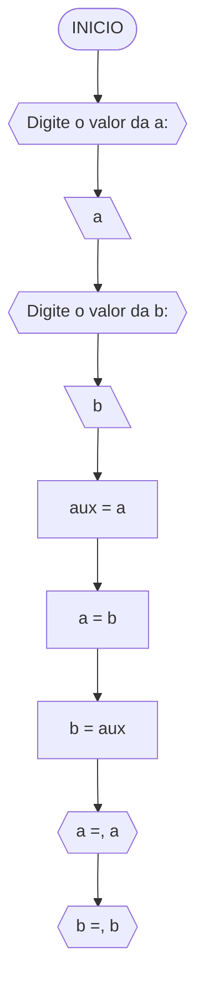
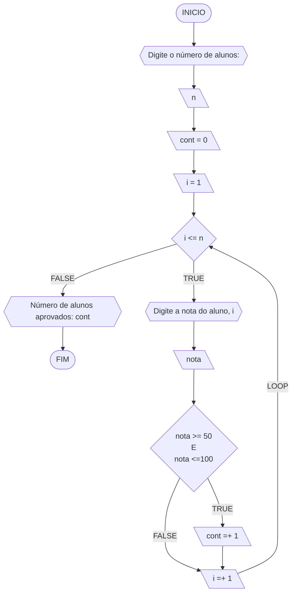
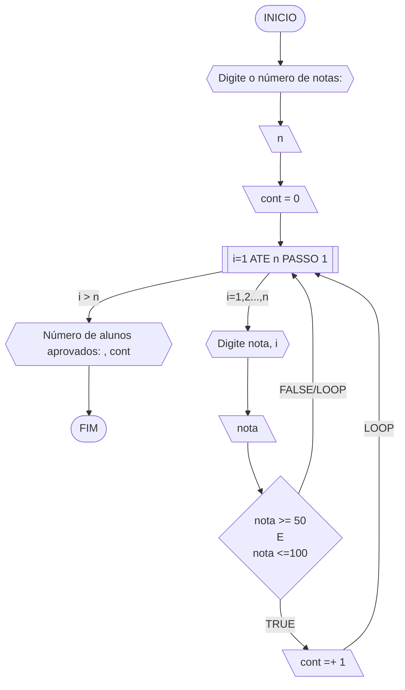
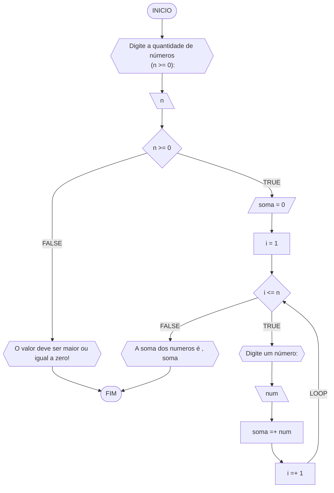
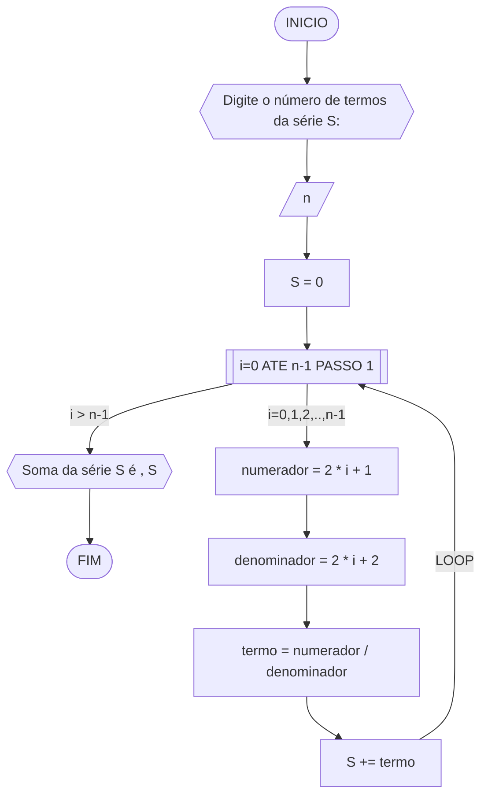
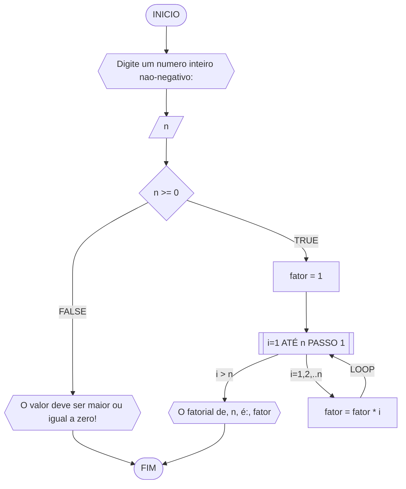
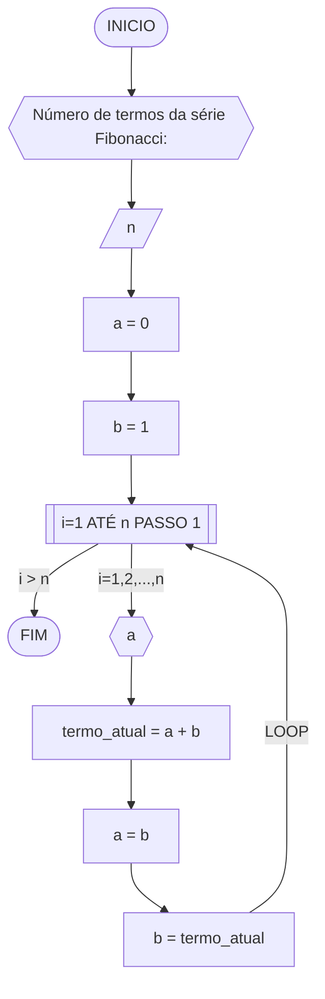
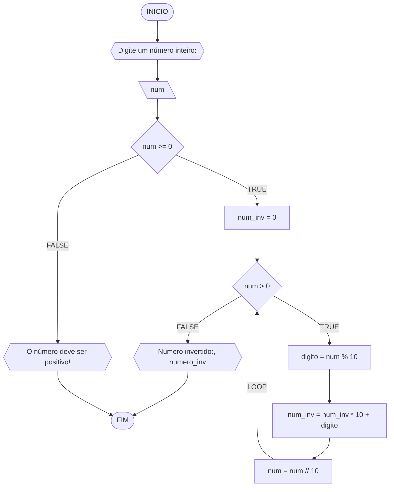

### Questão 1 - Troca dos valores de duas variáveis 

Dadas duas variáveis, $a$ e $b$, implemente e teste um algoritmo para trocar os valores atribuídos a elas.

#### Descrição geral do algoritmo

1. Guardar o valor original da variável $a$ em uma variável auxiliar $aux$;
2. Atribuir à variável $a$ o valor original da variável $b$;
3. Atribuir à variável $b$ o valor original da variável $a$, que está armazenado na variável auxiliar $aux$.
4. Exibir os novos valores de $a$ e $b$.

#### Fluxograma



#### Pseudocódigo 

```
ALGORTIMO TrocaValores
DECLARE a,b,axu: REAL

INICIO
    ESCREVA "Digite o valor da a:"
    LEIA a
    ESCREVA "Digite o valor da b:"
    LEIA b
    aux <- a 
    a <- b
    b <- aux
    ESCREVA "a=", a
    ESCREVA "b=", b
FIM
```
### Questão 2 - Contagem 

Dado um conjunto $n$ de notas de alunos em um exame, implemente e teste um algoritmo para fazer uma contagem $cont$ do número de alunos que foram aprovados no exame. 
Será considerado aprovado o aluno que tirar $nota$ 50 ou maior (no intervalo de 0 a 100).

#### Descrição geral do algoritmo

1. Obter o número de notas $n$ a serem processadas;
2. Inicializar a contagem $cont$ com zero;
3. Enquanto houver notas a serem processadas, fazer repetidamente:
    - obter a próxima nota;
    - se a nota for suficiente para passar no exame ($n ≥ 50$) então adicionar 1 (um) à contagem $cont$;
4. Exibir a contagem $cont$ (número total de aprovações).

#### Fluxograma 01
Fluxograma conforme descrição do algoritmo acima, usando o loop ENQUANTO.



#### Fluxograma 02
Fluxograma opcional usando o loop PARA.



#### Pseudocódigo 01 

```
ALGORTIMO ContaAprovacoes
DECLARE n, cont, nota, i: INTEIRO

INICIO
    ESCREVA "Digite a quantidade de notas dos alunos:"
    LEIA n
    cont = 0 
    PARA i DE 1 ATE n FAÇA
        ESCREVA "Digite a nota do aluno", i, ":"
        LEIA nota
        SE nota >= 50 E nota <= 100 ENTAO
            cont = cont + 1 
        FIM_SE
    FIM_PARA
    ESCREVA "O numero de alunos aprovados e:", cont

FIM
```
### Questão 3 - Soma de um conjunto de números 

Dado um conjunto de $n$ números, implemente e teste um algoritmo para calcular a soma desses números. <br>
Aceite apenas $n$ maior ou igual a zero.

#### Descrição geral do algoritmo

1. Obter a quantidade de números $n$ a serem somados.
2. Inicializar a variável $soma$ com 0 (zero).
3. Enquanto menos do que $n$ números tiverem sido somados, fazer repetidamente:
    - obter o próximo número $i$;
    - calcular a soma atual, adicionando o número $i$ obtido à soma mais recente;
4. Exibir a soma dos $n$ números

#### Fluxograma



#### Pseudocódigo 

```
Algoritmo SomaNumeros
DECLARE n,i,soma: INTEIRO

INICIO
    ESCREVA "Digite a quantidade de números<br> (n >= 0):"
    LEIA n
    SE n >=0 ENTAO
        soma <- 0
        i <- i
        ENQUANTO i <= n FAÇA
            ESCREVA "Digite um número:"
            LEIA num 
            soma <- soma + num
            i <- i + 1
        FIM_ENQUANTO
    SENAO
        "O valor deve ser maior ou igual a zero!"
    FIM_SE
    ESCREVA "A soma dos numeros é , soma"

FIM
```
### Questão 4 - Cálculo de uma série

Dado um conjunto de $n$ termos da série, implemente e teste um algoritmo para calcular o valor de S, conforme definido abaixo:

$$ S = \frac{1}{2} + \frac{3}{4} + \frac{5}{6} + \frac{7}{8} + \dots $$

#### Descrição geral do algoritmo

1. Obter o número de termos $n$;
2. Inicializar a variável $S$ com 0 (zero).
3. Iterar o valor de $n$ na variável $i$ iniciando com 0 (zero), de acordo com as instruções abaixo:
    - calcular o numerador na variável $numerador$;
    - calcular o denominador  na variável $denominador$;;
    - calcular o termo da série na variável $termo$, onde $termo = numerador/denominador$;
    - adicionar esse termo à variável $S$.
4. Exibir o valor da série $S$.

#### Fluxograma



#### Pseudocódigo 

```
Algoritmo SomaSerie
DECLARE n,numerador,denominador: INTEIRO; termo, S: REAL

INICIO
    ESCREVA "Digite o número de termos da série S:"
    LEIA n
    S <- 0
    PARA i de 0 ATÉ n-1 PASSO 1 FAÇA
        numerador = 2 * i + 1
        denominador <- 2 * i + 2
        termo = numerador / denominador
        S += termo
    FIM_PARA
    ESCREVA "Soma da série S é ", S

FIM
```
### Questão 5 - Cálculo fatorial

Dado um número $n$, implemente e teste um algoritmo para calcular o fatorial de $n$ (escrito como $n!$), onde $n ≥ 0$.

#### Descrição geral do algoritmo

1. Obter o número $n$, onde $n \geq 0$;
2. Inicializar a variável $fator$ com 1 (um) para armazenar o resultado do cálculo do fatorial;
3. Iterar o valor de $n$ na variável $i$, ou seja, executar $n$ vezes, as instruções abaixo:
    - Incrementar o valor atual $fator$ multiplicando pelo valor de $i$;
4. Exibir o resultado ($n!$).

#### Fluxograma



#### Pseudocódigo

```
ALGORITMO CalcFatorial
DECLARE n: INTEIRO

INICIO
    ESCREVA "Digite um numero inteiro nao-negativo:"
    LEIA n
    SE n >= 0 ENTAO
        fator <- 1
        PARA i DE 1 ATÉ n PASSO 1 FAÇA
            fator <- fator * i        // fator *= i
        FIM_PARA
        ESCREVA "O fatorial de, n, é:", fator
    SENAO
        ESCREVA "O valor deve ser maior ou igual a zero!"
    FIM_SE

FIM
```
### Questão 6 - Geração da sequência de Fibonacci 

Gerar e imprimir os $n$ primeiros termos da sequência de Fibonacci, onde $n ≥ 1$. <br>
Os primeiros termos são: $0, 1, 1, 2, 3, 5, 8, 13, \dots$. Cada termo, além dos dois primeiros, é derivado da soma dos seus dois antecessores mais próximos.

#### Descrição geral do algoritmo

1. Obter o número de termos $n$, onde $n \geq 1$;
2. Inicializar os dois primeiros termos da série nas variável $a$ e $b$ com 0 (zero);
3. Iterar o valor de $n$, ou seja, executar $n$ vezes, as instruções abaixo:
    - Imprimir o termo inicial $a$ (instrução para exibir a sequência ao atualizar a variável $a$);
    - Somar os termos $a$ e $b$ na variável $termo_atual$;
    - Atribuir a variável $a$ o valor da variável $b$;
    - Atribuir a variável $b$ o valor da variável $termo_atual$.

#### Fluxograma



#### Pseudocódigo 

```
ALGORITMO GeraFibonacci
DECLARE n, a, b, termo_atual: INTEIRO

INICIO
    ESCREVA "Número de termos da série Fibonacci:"
    LEIA n
    a <- 0
    b <- 1
    PARA i DE 1 ATE n FAÇA
        ESCREVA a
        termo_atual <- a + b
        a <- b
        b <- termo_atual
    FIM_PARA
FIM
### Questão 7 - Inversão dos dígitos de um número inteiro 

Implemente e teste um algoritmo para inverter a ordem dos dígitos de um número inteiro positivo.

#### Descrição geral do algoritmo

1. Obter o número inteiro positivo $num$ a ser invertido;
2. Inicializar a variável $num \textunderscore inv$ com 0 (zero);
3. Enquanto o número for maior que zero ($num > 0$), faça repetidamente:
    - Calcular o último dígito do número na variável $digito$;
    - Adicionar o dígito ao número invertido $num \textunderscore inv$;
    - Remover o último dígito do número original $num$; 
4. Exibir o número invertido.

#### Fluxograma



#### Pseudocódigo 

```
Algoritmo InverteInteiro
DECLARE num, num_inv, digito: INTEIRO

INICIO
    ESCREVA "Digite o número a ser invertido:"
    LEIA num
    SE num < 0 ENTAO
        ESCREVA "O número deve ser positivo!"
    SENAO
        num_inv <- 0
        ENQUANTO num > 0 FAÇA
            digito <- num % 10
            num_inv <- (num_inv * 10) + digito
            num <- num // 10
        ESCREVA "Número invertido:", num_inv
    FIM_SE

FIM
```


