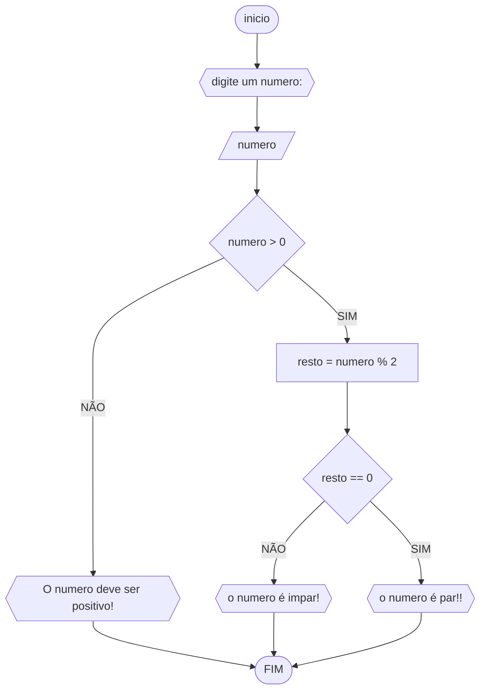

# UNIFOR
**Disciplina**Raciocínio lógico algorítmico <br>
**Orientador** prof. Ricardo Carubbi
## lista 1 de exercícios

### exercício 03
represente. em fluxograma e pseudocódigo, um algoritmo para determinar se um numero inteiro e positivo é par ou impa
#### Fluxograma


```
ALGORITMO  verifica_par_impar
DECLARE numero, resto INTEIRO
ESCREVA "Digite um numero:"
LEIA numero
SE numero > 0 ENTÃO
       resto = numero % 2
       SE resto == 0 ENTÃO
             ESCREVA " o numero é par!"
       SENAO
              ESCREVA " o numero é impar!"
 SENAO
    ESCREVA "o numero deve ser positivo!"
    FIM
    
```

    
| bllslf | lvlvws | aalm | saida |
| -- | -- | -- | -- |
|blaala| vllla | lasla | smskfm |
| md m | kdd | sk  | | 
### exercicio 2

### exercício 3
Represente, em fluxograma e pseudocódigo, um algoritmo para calcular a média aritmética entre duas notas de um aluno e mostrar sua situação, que pode ser aprovado ou reprovado.
#### fluxograma

#### pseudocodigo
```
Algoritmo media_aritimetica
DECLARE N1, N2 NUMERICO
ESCREVA "digite N1 e N2"
LEIA N1,N2
SE N1+N2 / 2 >= 7 
	ESCREVA "aprovado"
SENAO 
	ESCREVA "reprovado"
FIM_SE
FIM_ALGORITMO 
```
```

```
