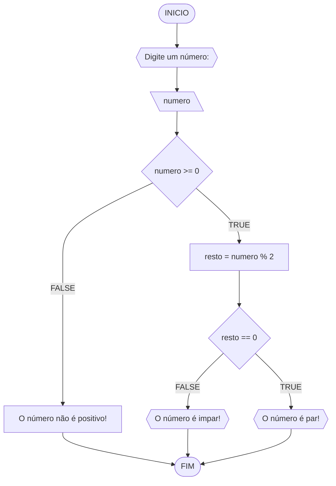
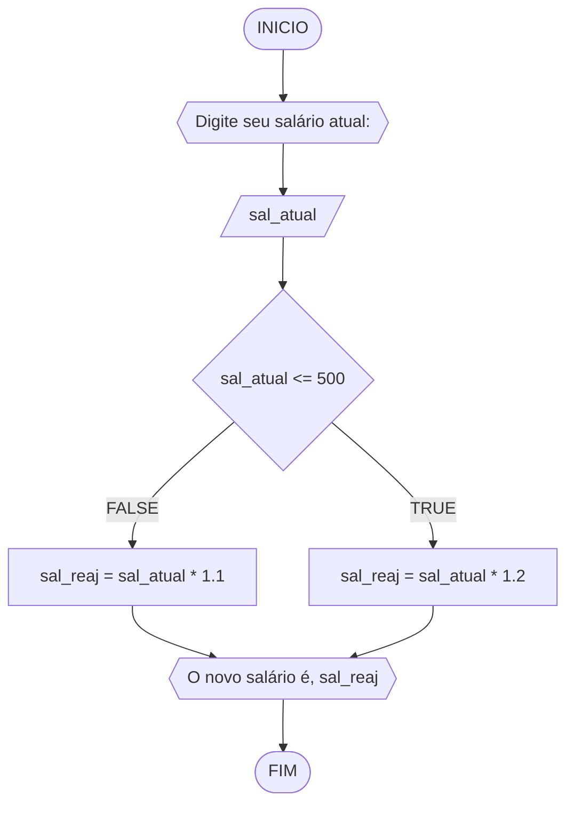
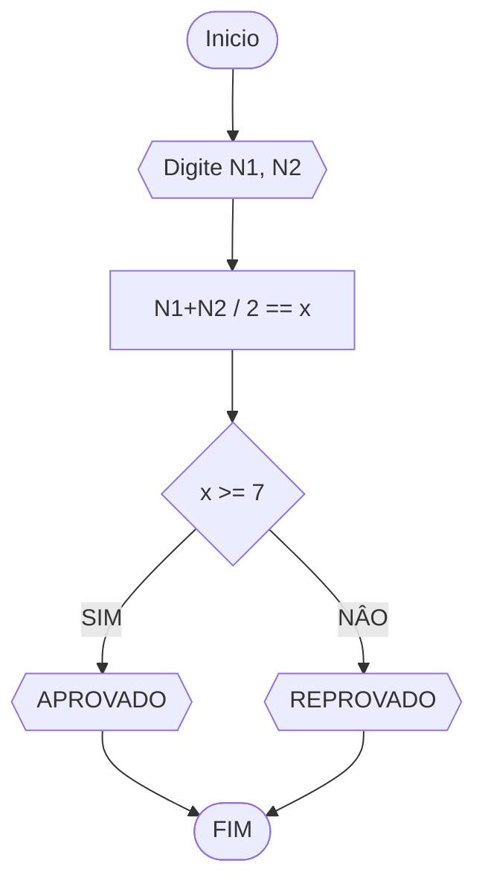
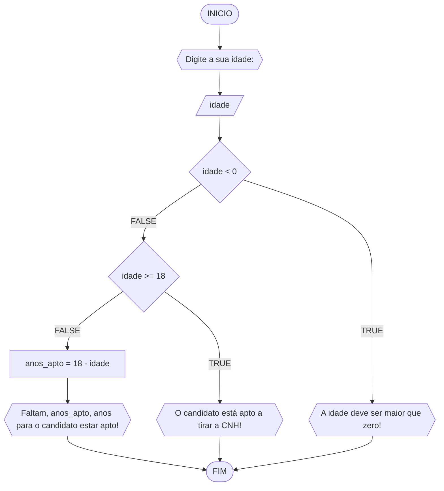

# UNIFOR
**Disciplina**Raciocínio lógico algorítmico <br>
**Orientador** prof. Ricardo Carubbi
## lista 1 de exercícios

### Exercício 01 
Represente, em fluxograma e pseudocódigo, um algoritmo para determinar se um número inteiro e positivo é par ou impar.

#### Fluxograma 



#### Pseudocódigo
```
ALGORTIMO verifica_par_impar
DECLARE numero, resto: INTEIRO

INICIO
ESCREVA "Digite um número: "
LEIA numero
SE numero >= 0 ENTAO
	 resto <- numero % 2
SE resto == 0 ENTAO
	ESCREVA  "O número é par!"
SENAO
	ESCREVA "O número é impar!"
FIM_SE
SENAO             
        ESCREVA "O número deve ser postivo!"

FIM_SE

FIM
```

## Exercício 02 
Represente, em fluxograma e pseudocódigo, um algoritmo para calcular o novo salário de um funcionário. 
Sabe-se que os funcionários que recebem atualmente salário de até R$ 500 terão aumento de 20%; os demais terão aumento de 10%.

#### Fluxograma 


#### Fluxograma

#### Pseudocódigo 

```
ALGORTIMO ReajusteSalario
DECLARE sal_atual, sal_reaj: REAL

INICIO
ESCREVA "Digite seu salário atual:"
LEIA sal_atual
SE sal_atual <= 500 ENTAO
	sal_reaj = sal_atual * 1.2
SENAO
        sal_reaj = sal_atual * 1.1
 FIM_SE
ESCREVA "O novo salário é R$", sal_reaj
FIM
```


### exercício 3
Represente, em fluxograma e pseudocódigo, um algoritmo para calcular a média aritmética entre duas notas de um aluno e mostrar sua situação, que pode ser aprovado ou reprovado.
#### fluxograma

#### pseudocodigo
```
Algoritmo media_aritimetica
DECLARE N1, N2 NUMERICO
ESCREVA "digite N1 e N2"
LEIA N1,N2
SE N1+N2 / 2 >= 7 
	ESCREVA "aprovado"
SENAO 
	ESCREVA "reprovado"
FIM_SE
FIM_ALGORITMO 
```
```

```
## Exercício 04 
Represente, em fluxograma e pseudocódigo, um algoritmo que, a partir da idade do candidato(a), determinar se pode ou não tirar a CNH. 
Caso não atender a restrição de idade, calcular quantos anos faltam para o candidato estar apto.

#### Fluxograma 



#### Pseudocódigo 

```
ALGORTIMO AptoCNH
DECLARE idade, anos_apto: INTEIRO
INICIO
ESCREVA ""Digite a sua idade:"
LEIA idade
 	SE idade < 0 ENTAO
ESCREVA "A idade deve ser maior que zero!"
	SENAO
		SE idade >= 18 ENTAO
 			ESCREVA "O candidato está apto a tirar a CNH!"
		SENAO
            		anos_apto <- 18 - idade
			ESCREVA "Faltam", anos_apto, "ano(s) para o candidato estar apto!"

	FIM_SE
		FIM_SE
FIM
```

