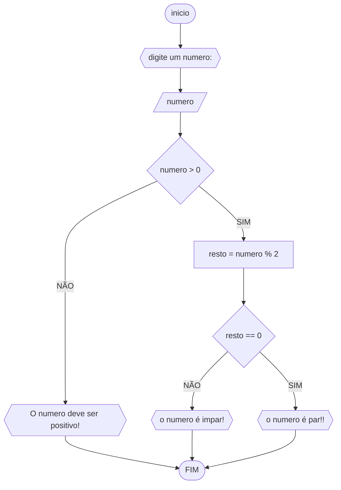

# UNIFOR
**Disciplina**Raciocínio lógico algorítmico <br>
**Orientador** prof. Ricardo Carubbi
## lista 1 de exercícios

### exercício 03
represente. em fluxograma e pseudocódigo, um algoritmo para determinar se um numero inteiro e positivo é par ou impa
#### Fluxograma



```
ALGORITMO  verifica_par_impar
DECLARE numero, resto INTEIRO
ESCREVA "Digite um numero:"
LEIA numero
SE numero > 0 ENTÃO
       resto = numero % 2
       SE resto == 0 ENTÃO
             ESCREVA " o numero é par!"
       SENAO
              ESCREVA " o numero é impar!"
 SENAO
    ESCREVA "o numero deve ser positivo!"
    FIM
    
```
