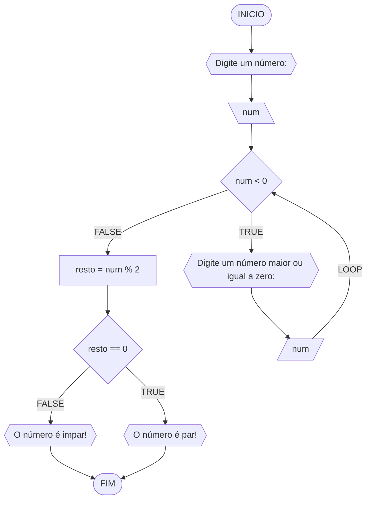
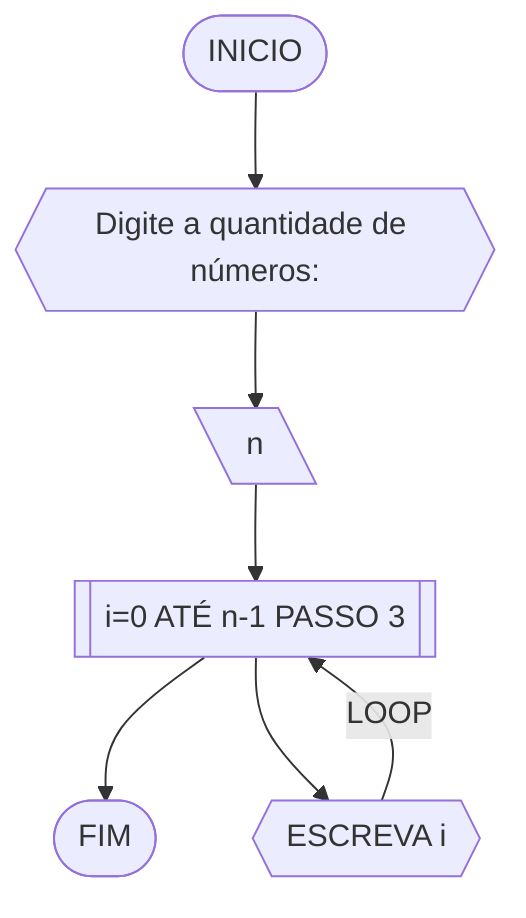
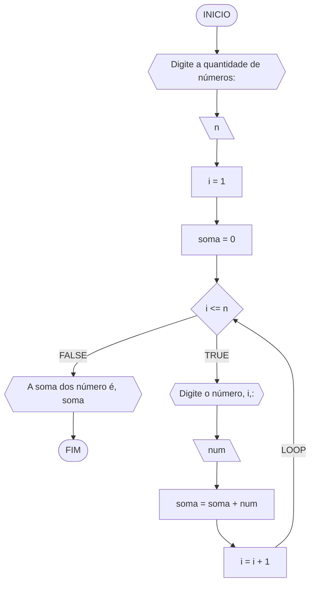
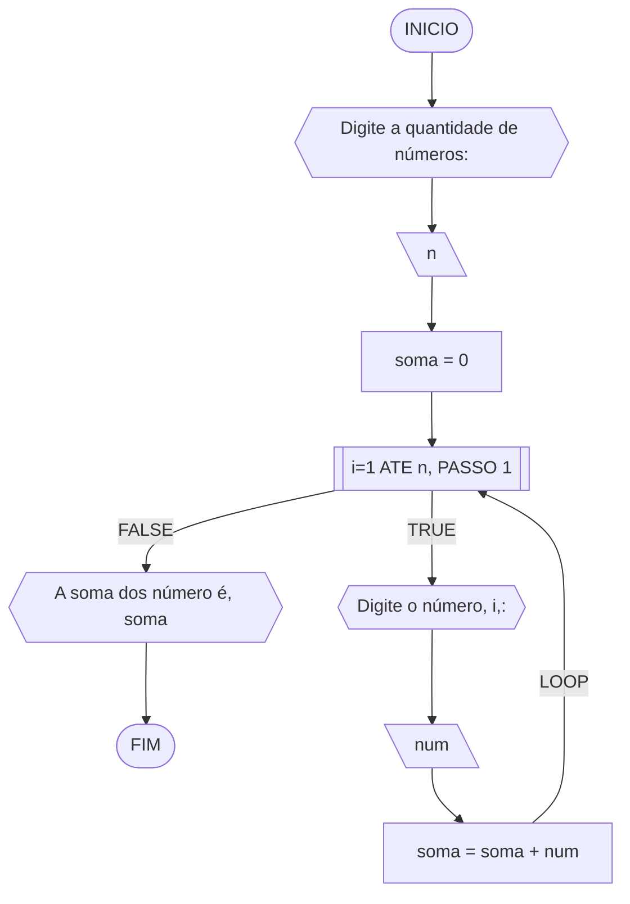
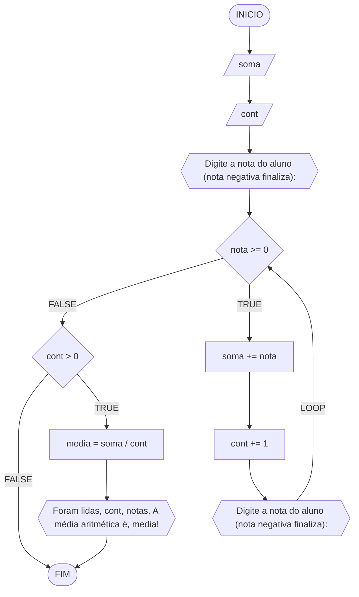

# UNIFOR
**Disciplina**Raciocínio lógico algorítmico <br>
**Orientador** prof. Ricardo Carubbi
## Lista de exercícios 03

### Exercício 01
Atualize o algoritmo para determinar se um número inteiro e positivo é par ou ímpar, usando uma laço condicional para aceitar apenas números maiores ou iguais a zero. 

#### Fluxograma



#### Pseudocódigo 

```
ALGORTIMO verifica_par_impar
DECLARE num, resto: INTEIRO

INICIO
	ESCREVA "Digite um número: "
	LEIA num
	ENQUANTO num < 0 FAÇA
		ESCREVA "Digite um número maior ou igual a zero:"
		LEIA num
    FIM_ENQUANTO
	SE num >= 0 ENTAO
		resto ← num % 2
		SE resto == 0 ENTAO
			ESCREVA "O número é par!"
		SENAO
			ESCREVA "O número é impar!"
        FIM_SE
	SENAO                               
		ESCREVA "O número deve ser postivo!"
    FIM_SE

FIM
```
### Exercício 02 
Faça um algoritmo que exiba na tela uma contagem de 0 até 30, exibindo apenas os múltiplos de 3.

#### Fluxograma 



#### Pseudocódigo

```
ALGORTIMO MultiploTres
DECLARE n: INTEIRO

INICIO
	ESCREVA "Digite a quantidade de números:"
	LEIA n
	PARA i DE 0 ATÉ n-1 PASSO 3 FAÇA
		ESCREVA i
    FIM_PARA
FIM
```
### Exercício 03 
Dada uma sequência de números inteiros, calcular a sua soma. 
Por exemplo, para a sequência {12, 17, 4, -6, 8, 0}, o seu programa deve escrever o número 35.

#### Fluxograma 1



#### Fluxograma 2


#### Pseudocódigo 

```
ALGORITMO SomaValores
DECLARE n,i: INTEIRO; soma,num: REAL

INICIO
	ESCREVA "Digite a quantidade de números:"
	LEIA n
	    soma <- 0
	    i <- 1
	ENQUANTO i <= n FAÇA
		ESCREVA "Digite o número", i,":"
		LEIA num
		soma <- soma + num
		i <- i + 1
    FIM_ENQUANTO
	ESCREVA "A soma dos número é", soma
FIM
```
### Exercício 04 
Escreva um programa que leia a nota de diversos alunos, até que seja digitada uma nota negativa. 
Nesse momento, ele mostra a média aritmética de todas as notas lidas e quantas notas foram lidas. 
Ex. Foram lidas 14 notas. A média aritmética é 6.75!

#### Fluxograma



#### Pseudocódigo

```
ALGORTIMO QuantMedia
DECLARE nota, soma, media: REAL; cont: INTEIRO

INICIO
	ESCREVA "Digite a nota do aluno (nota negativa finaliza): "
	LEIA nota
	soma <- 0
	cont <- 0
	ENQUANTO nota >= 0 FAÇA
		soma <- soma + nota
		cont <- cont + 1
		ESCREVA "Digite a nota do aluno (nota negativa finaliza): "
		LEIA nota

	FIM_ENQUANTO
	SE cont > 0 ENTÃO
		media <- soma / cont
		ESCREVA "Foram lidas", cont, "nota(s). A média aritmética é", media
    FIM_SE

FIM
```


    
```

