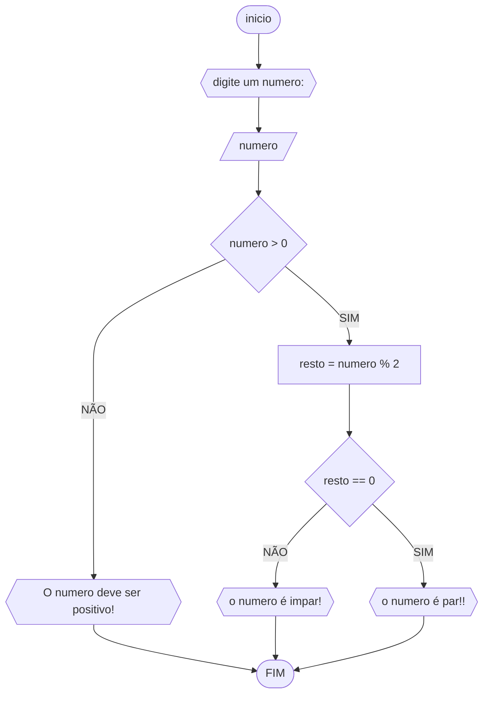

```mermaid
flowchart TD
A([inicio])-->B{{digite um numero:}}
B --> C[/numero/]
C --> D{numero > 0}
D--NÃO--> E{{O numero deve ser positivo!}}
E --> J([FIM])
D --SIM--> F[resto = numero % 2]
F --> G{resto == 0}
G --NÃO--> H{{o numero é impar!}}
G --SIM--> I{{o numero é par!!}}
H --> J 
I --> J 
```
